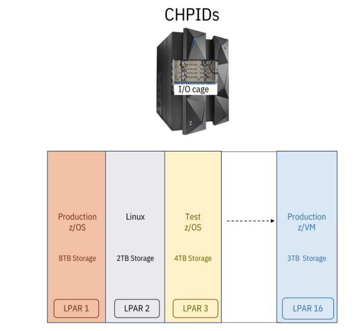
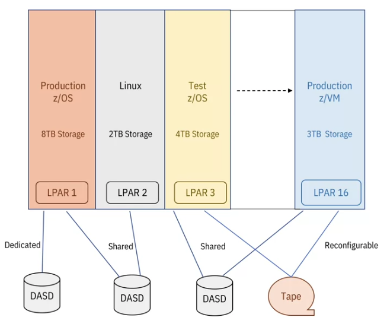
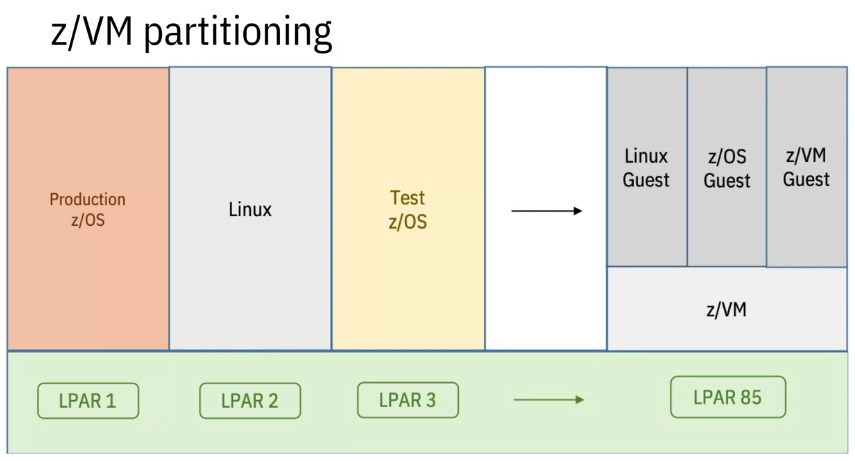
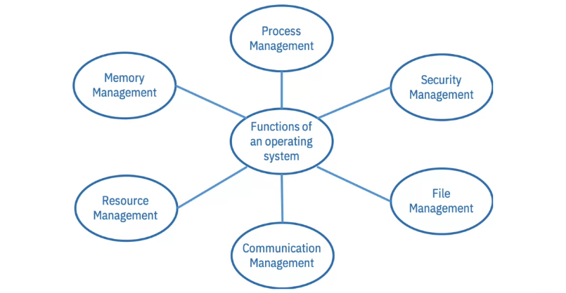
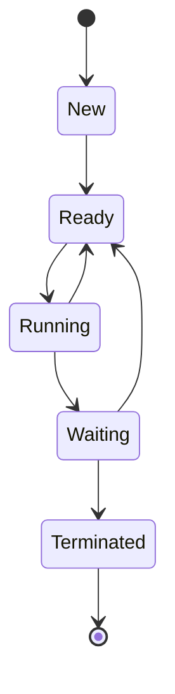
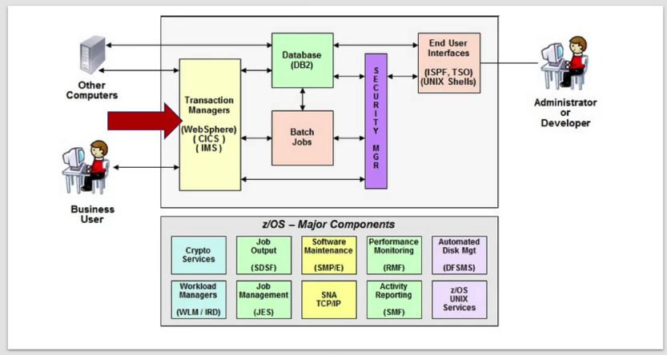

## Course Intro

Fortune 500 companies - billions of transactions per day.

Paychecks, health care, insurance, credit cards, bank accounts.

Must be fast, secure, and available.

That's what mainframes do.

It's the computer behind the scenes that specializes in scale, security, and reliability.

The mainframe is a computer that is physically purpose-built for big critical business applications.

It earns its up time through design, testing, and features.

OS: Linux, **z/OS**.

Special accelerators for cryptography, compression, network communications, managing data, virtualization, data management...

"Tell you what, you walk into a job interview, you tell them you know IOCDS, sis plex, palm live, and DFSMS, trust me, you're in a good place."

## Intro to Mainframe Architecture

### Computer Architecture

> "... the set of rules and methods that describe the functionality, organization, and implementation of the  computer system. ... this includes hardware, software, and everything in between, and all around it."

## Mainframe Architecture

[Why Do Mainframes Still Exist? What's Inside One? 40TB, 200+ Cores, AI, and more! ](https://youtu.be/ouAG4vXFORc?si=z9w0qiAYQI5fqHJ5)

Mainframes auxillary (AUX) storage (virtual memory) using **direct-access storage devices (DASD)**. Full of hard drives (SSD or spinning rust).

**Storage** includes both on-chip and AUX memory.

z/OS gives users and applications their own address space, all the way up to 16 exabytes.

Still 4K pages.

Pages in real memory are called **frames**. Pages in AUX storage are called **slots**. **Paging** is still the process of swapping the two.

A **page** is a fixed-length block of main memory that is used as a unit for the transfer of data between the AUX storage and main memory. The size of a page is typically 4K in a mainframe system.

A **frame** is a fixed-length block of main memory that is used as a unit for the allocation of memory to processes. In other words, it's the smallest unit of memory that the operating system's memory manager can allocate.

So, the difference between a page and a frame is essentially about their usage: a page is a unit of data transfer, while a frame is a unit of memory allocation.

* A block of central storage is called a frame.
* A block of virtual storage is called a page.
* A block of auxiliary storage is called a slot.

## Virtualization

Mainframes are physically comprised of many processors, a lot of storage and I/O, and it's got all the cooling and the power and the network required to make it run, along with other resources. 

Virtual systems can be and are built out of some subset of these resources running some OS.

These virtual systems are called a logical partition or LPAR. (Building an LPAR is like putting together LEGO bricks.)

TEST and PRODUCTION running in the same mainframe, for example. 

From the outside, an LPAR appears to be an actual computer.

The processors in a mainframe can be configured to run in various ways:

It can be a processor as we are familiar with them from desktop machines in which case it would run the OS and/or applications. These are call a **Central Processor (CP)**.

A **System Assist Processor (SAP)** sits between the CP and I/O as a dedicated I/O unit freeing the CP from handling I/O.

The **Integrated Facility for Linux (IFL)** are dedicated to running Linux on the mainframe. IFLs have special licensing associated with them so they are more cost-effective than using a CP for running an instance of Linux.

**z Integrated Information Processors (ZIIP)** allow you to offload certain workloads off the CP and onto them. For example, Java programs, certain parts of DB2, and XML processing. When doing so, the main CP is freed up for other tasks improving overall system throughput. Like IFLs, ZIIP are subject to special licensing that may make them more cost effective for certain applications.

I/O adaptors connect to AUX storage, network adapters, network attached storage, other mainframes, etc.

I/O adaptors are identified with **Channel Path Identifiers (CHPIDS)**. The CHPIDS is associate with a physical port location, or **Physical Channel ID (PCHID)**, and the logical subsystem that it's associated with. A subsystem is the connection between the LPAR and the I/O devices or other LPAR's that it needs to communicate directly with. 

You can put everything into one large subsystem or you can partition into multiple logical subsystems.

The CHPID is the association between the physical port and teh subsystem, you can think about it like being a line that connects the two.

A CHPID can be fully dedicated to a single LPAR or shared between multiple LPARs. It can also be unshared and reconfigurable, meaning it can be switched from one LPAR to another but only servicing one at a time. CHPIDs can also be configured as span, which means that it's  associated with
partitions from multiple logical subsystems. 

Z/VM is an operating system that specializes in virtualization. Z/VM is a type one hypervisor, meant it sits directly on top of the hardware. Within Z/VM you can create hundreds or thousands of virtual machines.

## Introduction to z/OS

Operating systems manage the computer.

### What is an Operating System

#### Process Management

Applications make requests vis APIs.

Process state:

#### Security Management

More later

#### File Management

The OS is responsible for talking to storage. 

#### Communications Management

Network all the things.

#### Resource Management

Ensures all applications play nicely.

There is competition for *all* the resources in the system.

#### Memory Management

Abstracts away all the complexity of getting memory for an application, swapping, etc.

### Mainframe Operating System

Now that you have an LPAR, you need to run an operating system on it.

Mainframes can run many different operating systems.

* z/OS
    IBM OS start with "z/"

    When the architecture moved to the 64-bit "z-architecture" the OS was renamed from OS 360.

Focuses on running a variety of services simultaneously. 

Other IBM mainframe OS:

* **z/TPF (Transaction Processing Facility)**: commonly used by companies dealing with high volumes of transactions that need to get handled in real time (credit card processors, airline reservation systems, hotel reservation, travel agencies, etc). 
* **z/VM**: level one hypervisor for hosting other guest OS. Runs on bare metal. Can be used to run multiple OS without using your alloted LPARS.
* **z/VSE (Virtual Storage Extended)**: smaller, less complex base for batch processing and transaction processing; for smaller businesses.
* **Linuz on IBM Z**: Literally Linux running on the mainframe. 
* **KVM on Z (Kernal-Based Virtual Machine)**: an open-source type 1 hypervisor. Integrates well with KVM on other systems, used for distributed workloads; scales horizontally ("scaling out"; add more instances of machines) as well as vertically ("scaling up"; increasing the capacity of a single machine).

#### z/OS

* premiere mainframe operating system
* built specifically for the z hardware
* offers continuous high volume operations
with high security and stability
* supports a huge ecosystem of different workloads
* supports a large numbers of simultaneous users
* maintains the highest quality of service for any operating system

"Componentized."

Some are base elements the OS always ships with and are configured by default.

Others, "add-on features", are not needed to run but are specific to the usage of the mainframe for your needs.

* **Transaction manager:** manages transactions across one or more resources
* **Database**
* **Batch jobs**: work that doesn't happen in real-time. For example, a delivery logistics company loads its trucks at night so they can hit the roads bright early in the morning when the drivers come in. They might take all the data about what deliveries need to be made that day and process it all at once, so it's ready when the drivers come in.
* **Crypto services**
* **User interfaces**: includes Time-Sharing Option (TSO) which makes it possible for *thousands* of users to share the system.
* A **job** is like a program with a specific set of input and output. For example, a payroll system that takes the number of hours, a person's wages, and creates a sheet basically saying, "pay this person this much" or maybe even cuts the cheques for them. The program doesn't change from run to run and its input and output is always in the same format even if the values change.
* You describe how you want your just to run in * **Job Control Language (JCL)** that gets submitted to the **Job Entry Subsystem (JES)**.
* When the system runs your job it processes the data and it puts the output into the job output.
* You use another component, the **System Display and Search Facility (SDSF)** to see the output.
* When it comes time to upgrade and manage software on a mainframe, it's important that everything gets managed and tracked. Some software depends on other software to run, so to install it you have to also install what's called a prerequisite. Sometimes you can't upgrade one piece of software without also upgrading another one. So how do you keep all of these dependencies straight? Fortunately, you don't have to, you have the **System Modification Program Extended (SMP/E)**.
* The Resource Measurement Facility (RMF) keeps tabs on how everything is being used and monitors performance, current and historical.
* The **Data Facility Storage Management Service (DFSMS)** manages storage, backups, migrations, and all I/O.
* **Workload Manager (WLM/IRD)**: ensures that when you're running multiple things at the same time on the same platform, they all get a fair slice of the system resources. But the Workload Manager takes it a step further. It's actually backwards from what you might be used to. You start by defining goals, you say whenever this type of transaction happens, it needs to finish in this amount of time. Or maybe it's just this LPAR over here is extremely important, it gets priority over all the other LPAR. So don't let anything they're doing slow down anything on this LPAR, it's the most important one. So when you set it up correctly, it's not a free for all, it's a carefully controlled and managed environment.
* **SNA TCP/IP (Systems Network Architecture)**: handles all network communications.
* **Systems Management Facility (SMF)**: defines a standard log format and records all actions taken. Handy for diagnosing problems, auditing transactions, and for tracing process flows.
* **Unix System Services (USS)**: provides a POSIX-compliant environment for running Unix software.

## Reading: Diving deeper into z/OS

The current release of z/OS is 2.3 (often written V2R3), with release 2.4 just around the corner. IBM releases a new version of z/OS every two years. Updating the z/OS on a system isn't trivial, and usually takes months of planning. Each z/OS brings new features to the Mainframe server, and just like with other devices, some of these features are only available on the latest hardware. 

It's a good time to review some of the technical documents that come with a new release of z/OS. You won't be tested on this, and please don't read too heavily into these documents, but they'll make for great references later on in your training. 

* [What's new in z/OS 2.3](https://www.ibm.com/support/knowledgecenter/SSLTBW_2.3.0/com.ibm.zos.v2r3.e0za100/chnewfu.htm)
* [z/OS 3.1.0](https://www.ibm.com/docs/en/zos/3.1.0)
* {Meet z/OS](https://www.ibm.com/products/zos)
* [z/OS 2.4 FAQ.pdf](<files/zOS 2.4 FAQ.pdf>)

