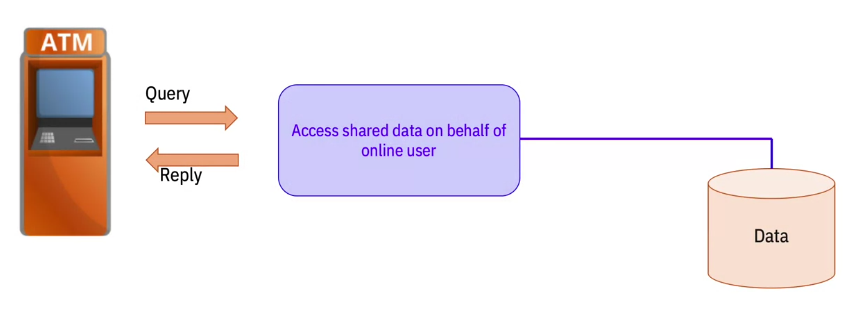
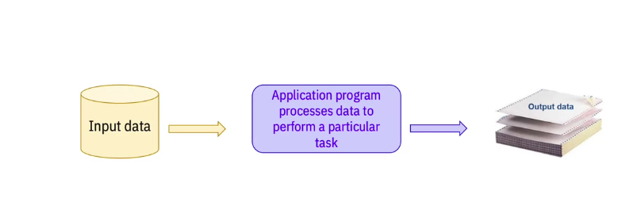
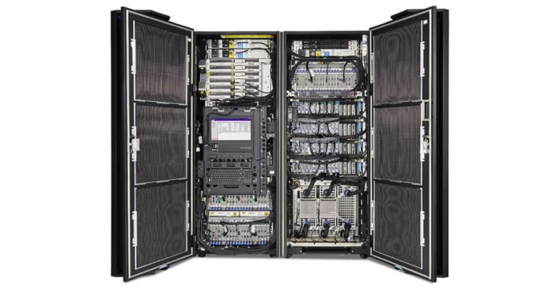
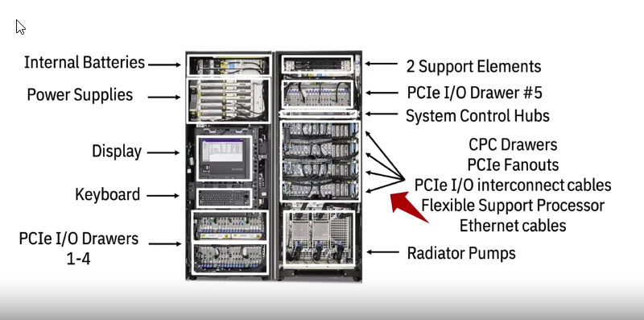
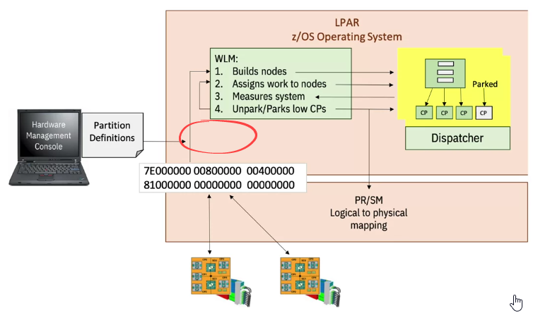
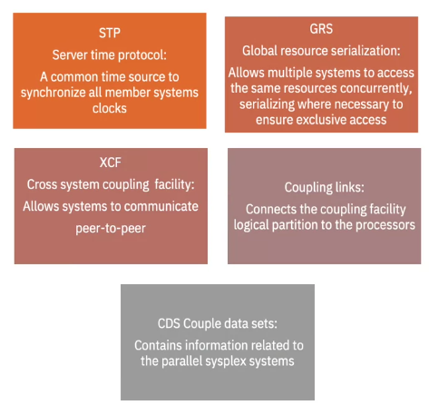
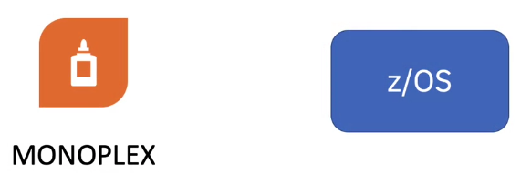
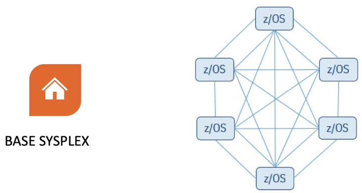
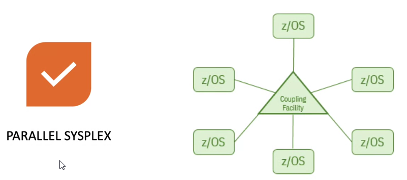

## Why Use Mainframes?

Mainframes are open, adaptable, and every-evolving.

When companies started using Linux, Linux became a supported operating system. 

When open source software and hybrid cloud models started becoming part of the way work gets done. You started seeing APIs and cloud-ready solutions appear on the Mainframe. 

> Why do I want to run Linux on the mainframe? What if I could make a Linux instance with 15 processors and a couple gigs of memory? And I also wanted to access 32 different storage area networks and a couple of different network VLANs. Well, I can get that big powerful Linux system. But I can also run that Linux with all of its data being encrypted, at all times, through pervasive encryption. So that's possible and that's pretty cool. I could build five more of those same exact servers, without needing five times the physical resources because of virtualization. That's a huge bonus. I can even bring up Linux Docker instances within the z/OS operating system, where they can run right next to z/OS applications. So I don't need a full system image, if there's just one specific application in need. 

Consolidation. One, larger machine vs multiple smaller ones.

Real-time transactions...

...batch processing.bb

...mainframes excel at both, from a performance security and a data integrity point of view.

Mainframes run 68% of the world's production workloads. Despite running two-thirds of the world's production workloads, they take up only 6% of the total IT cost. 

## IBM Z Hardware Components

Good chance you will be working with an IBM z14.

* **CPC Drawers:** contain the processors and memory
* **PCIe Fanouts:** connections for PCIe hardware
* **Flexible Support Processor:** redundant interfaces to all internal management networks so you're never locked out, you can always log in
* **DCA Inverters:** provide various voltages required by different components
* **Radiator Pumps:** uses cold air blown up from the floor to cool the machine, blows hot air out the back, and circulates refrigerant throughout the system; water-cooled systems also exist
* **PCIe I/O Drawer:** This is where all the input-output devices live such as crypto cards,network cards, compression cards, etc.
* **Internal batteries:** two, redundant backup power supplies that allow for safe shutdown with no loss of transactions in flight
* **Power supplies:** 4 of em (or fewer)
* **Support elements:** keyboard, screen, and two servers - see [HMC and SE](#HMCandSE) below

Pictured above is a two-frame machine. 

Single-frame machines are called business-class machines are meant for business that do not need as much power.

Some newer systems fit in industry-standard 19-inch racks.

## Mainframe Features

> The mainframe is an ever evolving platform. New features are constantly being developed, existing components are getting upgrades, and its capabilities are always being extended to  meet the world's business demands. As it evolved the Mainframe gained some unique capabilities that you won't find anywhere else, and I'd like to cover a few of those here. 

* **Intelligent Resource Director (IRD)**: optimizes processor and channel resource use across LPARs within a single Z-system. Groups LPARs into clusters allowing WLM to manage resources for the cluster in a single image.
    * allows for more flexible LPAR CPU management
    * dynamic channel path management (DCM), FICON (Fibre Connection) channel bandwidth (primarily used for connections to storage devices) can be moved between dick control units to meet demand
    * channel subsystem priority queuing allows I/O requests to have priorities assigned to them for more control over handling
* **HiperSockets:** provide high-speed, virtual connections between servers in the same physical system.
* **HiperDispatch:** With virtualized LPARs, the system looks at the pool of available processors and lines up that specific unit of work with an available processor that can handle it. Some workloads gain performance by ensuring that the work is dispatched to the same processor as frequently as possible. So there's no wait while we figure out which processor the work should go on and we also benefit from reusing relevant data
left in the cache from previous operations. 

    

* **z Discovery and Autoconfiguration (zDAC):** streamlines the process of discovering and configuring hardware.
* **Virtual Flash Memory (VFM):** sits between on-chip memory and DASD. Physical memory that lives in the same box as the CPU and RAM. Provides a boost for programs that take a substantial performance penalty when they page data like DB2, Java, and others.
    * Improved performance
    * Reduces delays from dumps
    * Automatically encrypted
    * Easily deployed and configured
* **zAware ( z Advanced Workload Analysis REporter):** watches monitors system performance (Network configuration changes, LPARs coming up, and going down, software levels changing, new user IDs getting created, etc.) and highlights anomalies and suggesting courses of action in 
near real-time. You can even use zAware's interface to diagnose the cause of past or current anomalies. 

[IBM Z Configuration Setup](<files/IBM Z Configuration Setup.pdf>)

## What is Millicode?

Millicode is a form of micro-architecture that runs on IBM Z.

Micro-architecture: a layer between what is
published in the principles of operations and the system architecture. Allows for backwards-compatibility.

Also handles system initialization (system is powered-on, initial mackine load (IML)), and virtualization.

## HMC and SE

A computer within the computer.

Used to configure the mainframe and get it ready to boot, and to connect peripheral devices.

2 SE's for redundancy. 

In addition to the SE which required physical access to the mainframe, the **hardware management console (HMC)** which:

1. lets you access the SE's functions remotely
2. you can add multiple mainframes to an HMC (up to 100)
3. a mainframe can be added to multiple HMC's (up to 32)

Anything that cam be done from the SE can be done via the HMC and vice versa.

## Sysplex

A way of making multiple systems work together.

This can be LPARs on one box or it can be spread across many boxes.

* **Server Time Protocol (STP):** protocol for synchronizing clocks across the machines
* **Global Resource Serialization (GRS):** allows for multiple systems to access the same resources concurrently, serializing where necessary to ensure exclusive access; "without GRS you'd have quite a mess"
* **Cross Coupling Facility (XCS):** allows you to be logged into one system and issue commands on behalf of another system in that sysplex
* **Coupling Links:** allow direct memory access between sysplex memory and the memory of an attached system
* **Coupled Data Set (CDS):** allows safe simultaneous access to a data set by multiple users or programs (locking file)

sysplex (logical entity) *is comprised of* multiple mainframes (physical entities) *which contain* multiple LPARs (virtual entities)

**monoplex:** a sysplex with one LPAR. Seen in testing and staging, beyond that it doesn't buy you any additional performance.

**base sysplex:** every system has a connection to and can see every other system.

**parallel sysplex:** most common. Systems are connected to a *coupling system* - a special kind of LPAR that handles all the complexities and overhead of the connected systems working together. Often there are backup (redundant) coupling systems on other mainframes in the sysplex.

A **rolling IPL (initial program load or boot up of a mainframe)** allows for upgrades of hardware and/or software on machines in the sysplex without taking down the entire sysplex. A parallel sysplex doesn't require all the systems in it to be up in order to function. In this way, you can have a mainframe with uptime on the order of decades.

[A complete IBM Z Glossary of Terms](<files/A complete IBM Z Glossary of Terms.pdf>)
