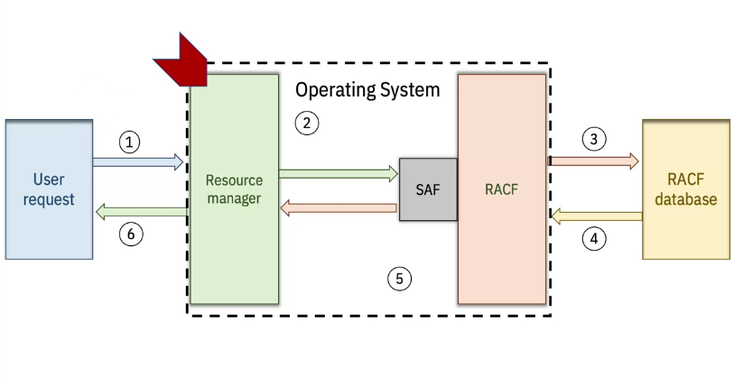
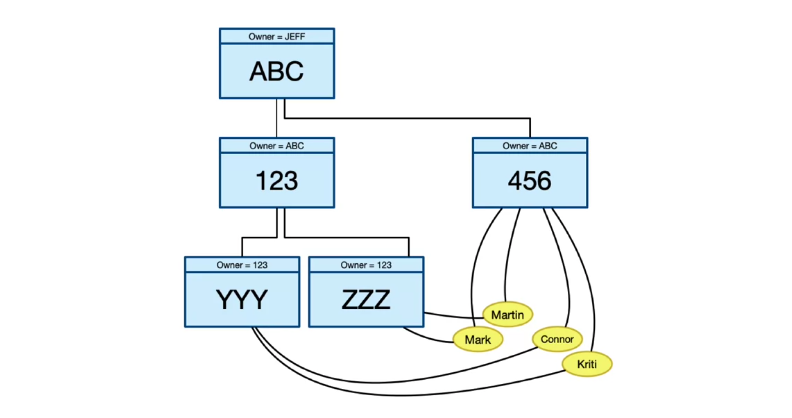
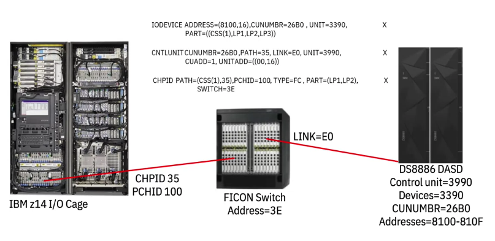

## z/OS Security

Security:

* Confidentiality: limits the access users have to system resources (files, devices, applications, etc.)
* Availability: ensuring that the resources a user does have access to are available to them
* Integrity: being able to verify that the system (data, programs, and hardware) has not been compromised

When a user or program accesses a resource (a data-set, a disk storage system, a program, a terminal, etc):



1. the user or program makes a request to the **resource manager** (which ultimately makes or doesn't make the connection between the user and the resource)
2. the resource manager queries the **System Authorization Facility (SAF)** which acts as a router and routes the request to the right system to make the determination as to whether the user can access the resource (in this example, we are using the **Resource Access Control Facility (RACF))**
3. The RACF queries the RACF database to determine what access permissions the user and the resource have assigned to them; RACF may determine that the user can have access, should not have access, or that it has no records about either the user or the resource and will report this back to the resource manager via the SAF

This is all made possible by the **4767 cryptographic co-processor**, a **hardware security module (HSM)** that provides various cryptographic functions on its specialized hardware. On z, that the **Crypto Express**, one of the PCIe cards in the I/O section of the mainframe. This card supports the **Federal Information Processing Standard, (FIPS)**, a US government security standard. It supports security level four, which is the highest level of security. At this level, the physical security mechanisms provide a complete envelope of protection around the cryptographic module. The card is capable of detecting that it's been tampered with and will delete any sensitive information on it including the cryptographic  keys. All of this helps create the most secure computing environment around. 

### Security Addendum

User logins can be configured to use a password, a passphrase, or both (or neither). 

If the user enters a password of eight or fewer it get passed to the security product as a password. If it's greater than eight characters it can be passed as a passphrase.

RACF manages user profiles. It's made of:

* User ID
* Owner of the ID (user or group)
* Password/Passphrase (encrypted before stored)
* Special attributes (admin)
* Groups 
    * users can belong to multiple groups
    * each group with the exception of `SYS1` has a superior or owning group
    
    * each group profile has an owner that can be a user or a group
    * when a user is part of a group, we say that user is connected to that group
        * connor, mark, martin, and sarah are connected to the 456 group

User access to a data set is not binary. Some of the frequently used *access authorities* are:

* alter - allows fill access and control including creation, deletion, renaming, etc.
* update - lets the user read from or write to a resource but not delete it
* read - means read only
* execute - is for the z/OS load libraries; it lets you open the dataset for the purpose of loading a program from the library
* none - none

Catalogs are listings of commonly used datasets. 

* Master catalog - where all the systems catalog datasets live
* User catalog - where each user puts their own catalog datasets

For the **master catalog**, the system programmer would require the alter access. People who are responsible for defining aliases in the master catalog, would only need the update access, and all the users who need to access the catalog to read it, would need read access.

For the **user catalog**, people who maintain the user catalogs require alter access, while users who can update their own user catalogs, need update access. 

Then there's this **protect all** option. This lets you declare that any datasets created on your system need to be RACF protected, or at least known of by RACF. What's really handy about this, is that it stops users from creating new dataset high-level qualifiers, unless they fit into the existing list of RACF protected data sets. This is a good safety net for ensuring everything is covered. 

An important feature of RACF is recording access attempts. If logging is enabled, we can have that information get recorded in SMF, the System Management Facility. The SMF data can be used to produce reports. 

A **discrete dataset profile** controls access to a single dataset.

If we have a group of datasets we want to control, we can use what's called, a **generic dataset profile**. 

When you want to build and maintain the list of users and groups that are authorized to access a resource,
you use the **permit** command.

You only get to use the permit command if:

* you have the special attribute
* or if you have a profile within the scope of a group where you have the group special attribute
* or if you own the resource
* or if the resource is a dataset and the high level qualifier is your user ID

### Transaction Level Security

Encryption.

Control the keys.

256-bit or higher-level encryption. Still, rotate key.

Symmetric encryption - same key for encrypting/decrypting. Difficult to scale, keys must be distributed safely.

Public key cryptography - Public key can be safely shared and is used to encrypt data, private key is used to decrypt and must be kept secret.

Public key crypto can also be used for signing documents and creating hashes for data to guard against alteration.

The IBM Z has dedicated facilities and hardware to enable accelerate and further secure these cryptographic functions.

The CP Assist for Cryptographic Functions (CPACF) are functionality provided on the processors specifically built largely around symmetric key functions and can greatly speed up things like VPN, SSL, and data storing applications.

There's also the Crypto Express PCIe card, a dedicated card that handles more advanced cryptographic functions.

By offloading cryptographic work to specialized software and hardware we were able to keep our keys safe while still making encryption, decryption, and other cryptographic capabilities readily available to **all** aspects of Z data processing.

Starting with the Z 14 version of the IBM Z mainframe, there's a feature called **pervasive encryption** which lets us more easily keep data encrypted while still allowing us and others to manage that data. Data is decrypted at the moment it is actually needed.


### Crypto Express Key Management

Crypto express card: **secured keys** versus **protected keys**. 

When you're using a key, the most important thing you have is keeping that key secure. Private, known only to those people who need to have access to the key.

When you put a key into the crypto express card, you can put a key in there in a manner such that it will never ever leave that card in the clear, ever. We call that a **secured key**. 

When you're doing cryptographic operations, however, you might want to have the key in storage for performance reasons. We'll call that a **clear key**. A clear key doesn't mean that everybody can read it. It might be in fetch protected storage that only trusted and authorized people within the Z OS environment can access. 

With a crypto express card and something called protected keys, you can get the best of both worlds. 

The key that exists in the crypto express card can be wrapped with a transport key or an LPAR-specific key, sometimes called a *ephemeral key*. You can take that wrapped key, transport it over to the z/OS environment where it can be used by the CPACF, the central processor assist for cryptographic function. That is the high-performance cryptographic engine that exists for every central processor in an IBM Z environment.

z/OS can't read that key, but what it can do is pass that wrapped key to the CPACF. The CPACF can use the key that was used to wrap it, which is available to it because it's the hypervisor, and then CPACF can do
very high-performance cryptographic encryption and decryption using that key.

## IOCDS

Input/Output Control Data Set (IOCDS)

Earlier when we were talking about the parts of the mainframe, we looked at where the CPU and the processors are, and that's called the **CPC or Central Processor Complex**. We also saw where all the IO adapters are.

Did you wondered at all where all the hard drives are?

In a mainframe environment, disk storage is handled by something called **Direct Access Storage Devices (DASD)**. These are big, almost mainframe-sized units full of hard drives, both mechanical and solid-state.

They can provide the disk storage for a mainframe. They can actually provide disk storage for many mainframes, and many DASD can be connected to a single mainframe.

In order to make these connections to devices like DASD and others, we need to define the logical paths
through the physical connections so it all works. The **Input Output Control Data Set (IOCDS)** represents the connection between the resources and the systems that use them. 

(Resources are things like Channels, FICON switches, Control Units, and other devices, basically anything outside of the mainframe that we want to connect to, and the stuff inside the mainframe that we're going to use to connect to it.)

when you define an IO configuration, you provide the physical, as well as the logical information about those resources.

In the mainframe, there's an **Input Output subsystem**, or IO subsystem. This controls the channel operations. That requires the information about the hardware IO configuration. To define this, we use a program called the **Input Output Configuration Program (IOCP)**. 

The IOCDS is built through a series of statements, you build it brick by brick.

Once you build it, the IOCDS gets stored on the SEs.

To use IOCP to build an IOCDS, you need to know about four things:

* the LPARS or partitions are that you want to work with the Channels - the links between the LPARs, and the physical ports on the IO cards
* Channel Paths - each one has an ID, pronounced as CHIP-ID. We're defining a logical connection on there with the CHPID; the Channel Path exits the mainframe of a physical ID, or a PCHID.
* Control Units - are attached to Channel Paths, and they're what actually drives the device we're connecting to; having a dedicated Control Unit that is really good at handling devices like disk or tape means the mainframe operating system doesn't have to worry about all those deep down details
* the  Input Output device - The thing we're actually trying to talk to which the Controlling Unit is tasked with controlling.

5 IOCP statements:

* ID Statement (optional)
* Resource Statement (required)
* CHPID Statement (optional)
* CNTLUNIT or Control Unit (optional)
* IODEVICE Statement (optional, kinda)



Let's see what it actually happens, once we start defining things with these statements. What we're going to be doing with the following five statements is building a connection between an LPAR through a CHPID, out a PCHID, through a FICON unit, and out to a 3390 DASD unit. 

```text
[symbol]    ID  {MSG1='message'}
                {MSG2='message'}
                {SYSTEM=(processor[,number])}
                {LSYSTEM=name}
                {TOK=token}
```

[Input/Output Configuration Program User's Guide for ICP
IOCP](<files/Input Output Configuration Program User's Guide for ICP IOCP.pdf>)

## Starting Up an IBM Z Server

### Activation Profiles

CPC - Central Processor Complex

Activation profiles contain configuration information about the CPC and all its LPARs, as well as the OS that will run on them.

The activation profile gets stored on the SEs.

When you use the HMC or the SE to boot up, or IPL an LPAR, it's going to read from the activation profile to see exactly what it's supposed to do. 

#### IPL vs POR

IPL (initial program load) - loads a copy of the OS from the system resident device into main storage and executes it.

POR (power on reset) - loads the input output configuration data set from the support element hard drive into the hardware system area and creates subchannels for each device defined in the IOCDS.

Doing a POR means stopping everything that is currently running on all of the LPARS and taking everything down. So POR are typically something that is planned far in advance, to minimize the effect of that downtime. 

Four types of activation profiles:

* reset - determines how the licensed internal code will be loaded and how much central and expanded storage it will get
* image - each LPAR has an image profile defining the LPAR parameters like how many processors it'll get, also how much memory it'll get; spells out if those processors are dedicated to that LPAR or if they're shared with others
* load - needed to determine the channel addresses of the device that the operating system is going to be loaded from
* group - provides a way of grouping objects so you don't have to change an object's activation profile
every time you want to activate it

### IPLing an Operating System

An initial program load is technically the act of loading a copy of the operating system typically from DASD into the processors main storage area and running it. 

[z/OS MVS System Initialization Logic Initial Program Load (IPL)](<files/zOS MVS System Initialization Logic Initial Program Load (IPL).pdf>)

